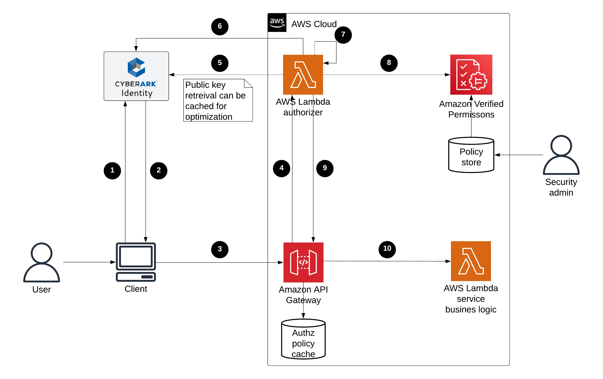

# Identity Verified Permissions Demo

**Disclaimer:** This is not production grade code. You should not use this Content in your production accounts, or on production or other critical data. You are responsible for testing, securing, and optimizing the Content, such as sample code, as appropriate for production grade use based on your specific quality control practices and standards. Deploying Content may incur AWS charges for creating or using AWS chargeable resources.

This is a demo project to present Amazon API Gateway access control based on Amazon Verified Permissions as the access control engine and an API Gateway Lambda authorizer as the method to control the access to Amazon API Gateway resources. A Lambda authorizer is an Amazon API Gateway feature that uses an AWS Lambda function to control access to your API. When a client makes a request to access a resource, Amazon API Gateway calls your Lambda authorizer, which takes the caller's identity as input and returns an IAM policy as output. Amazon API Gateway then uses this IAM policy to authorize the request to the method.

The demo uses CyberArk access token and performs the authorization using the Amazon Verified Permissions service.

Checkout our open source projects: [https://github.com/cyberark/](https://github.com/cyberark/)



- The flow starts with the client accessing the service and authenticating to the IdP [1], which returns an access token on a successful attempt [2].
- The browser/client calls the service API Gateway method with that access token [3].
- API Gateway calls the Lambda authorizer passing the token and method Amazon Resource Name (ARN), as described in the documentation [4].
- The Lambda authorizer:
  - Verifies the token signature by using the public key received from the IdP [5].
  - Extracts the token claims and retrieves custom user attributes from CyberArk Identity [6].
  - Prepares a request in Amazon Verified Permissions format [7] and invokes the service to authorize the request [8].
  - Builds an IAM policy based on Amazon Verified Permissions decision and returns it to the API Gateway [9].
  - API Gateway invokes the service Lambda function (if the request is allowed) [10] and returns the response to the client.

## Prepare an Amazon API Gateway with a token authorizer and a sample protected resource

To create the API Gateway with the token authorizer code and a resource use the following command:

```bash
./prepare_authorizer_package.sh <s3 bucket name> <cyberark identity url> <region>
```

For example:
```bash
./prepare_authorizer_package.sh avp-demo-bucket https://xxxx.id.integration-cyberark.cloud/ us-east-1
```

This stript creates the following resources:
- A Lambda function that acts as a token authorizer
- A Lambda function that acts as a token authorizer with a token
- An API Gateway with a resource that is protected by the token authorizer
- An API Gateway with a resource that is protected by the token authorizer with a token
- A policy store with a schema for an ID Token authorizer


### AWS Lambda Authorizer token authorizer performs

- Validate token signature and extracts the claims in it
- Retrieve user attributes
- Formalize the token claims to Amazon Verified Permissions format
- Invokes an authorization check using Amazon Verified Permissions and gets the decision
- Converts the decision to an IAM Policy format and returns it (to the API Gateway)

### Script outputs
The cloud formation will create an API Gateway with a token authorizer and a sample resource. 
The outputs are the following:
- An AWS API Gateway with a token authorizer.
  The API Gateway name is 'Sample API Gateway'
- A resource called **'protected-resource'** with POST method. 
  - To access to that resource, you need to provide a valid token. 
  - The token is validated using the Lambda authorizer. 
    The lambda authorizer extracts the principal from the token claims
  - The name of the custom authorizer is 'AmazonVerifiedPermissionAuthorizer' and calls the lambda function called 'avp-lambda-authorizer'
    retrieves additional user attributes from CyberArk Identity
  - The AWS Lambda authorizer invokes the Amazon Verified Permissions service to authorize the request.
  - The authorization is done using is_authorized() function in the lambda authorizer.
- A resource called **'protected-resource-token'**
  - This resource is protected by a new AWS Lambda Custom Authorizer that uses the token as the principal.
  - The name of the custom authorizer is 'AmazonVerifiedPermissionTokenAuthorizer' and calls the lambda function called 'avp-lambda-authorizer-with-token'
  - The lambda function calls the Amazon Verified Permissions service to authorize the 
  - request with is_authorized_with_token() function.
  - The policy store, is set to have an Identity Source configuration, set to trust CyberArk Identity as the IdP.

```bash


## Testing the setup

Install the prerequisites:

```bash
pip install -r requirements.txt
```

To invoke the script run:

```bash
python access-demo-resource.py -u <username> -i <identity url> -g <resource url>
```
Enter your password on this prompt "Enter your password: " and the script will invoke a login and API Gateway Call. 


### Comments

1. the username should be in this pattern: `user_name@cyberark_identity_domain`. For example, `my_user@trialdomain`.
2. You can change the user attributes. For example, use different `user_dept` value.

In case you are authorized, the result message is `Hello from Lambda!`. Otherwise, you get `User is not authorized to access this resource with an explicit deny`.

### Troubleshooting

These are the common steps to troubleshoot:

1. If you get `Could not resolve host`, it may be a wrong Amazon API Gateway address.
2. Review AWS CloudWatch Logs of the Lambda authorizer function. Verify a call on the time you performed the request.
3. Check that the logs contain the inputs to the Lambda authorizer as the authorization header and method ARN.
4. Check the result of the Lambda authorizer that you get an `Allow` decision from Amazon Verified Permissions
5. Check that the authorization token is in the correct format. You can use [jwt.io](https://jwt.io/) to decode it online.

# License

These code examples are licensed under the Apache License 2.0 - see [`LICENSE`](LICENSE.md) for more details.
